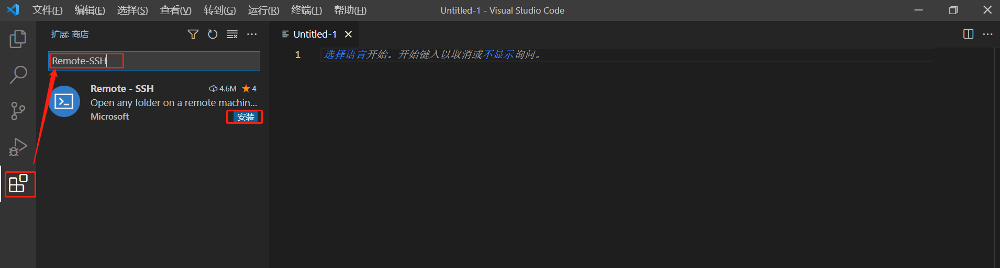
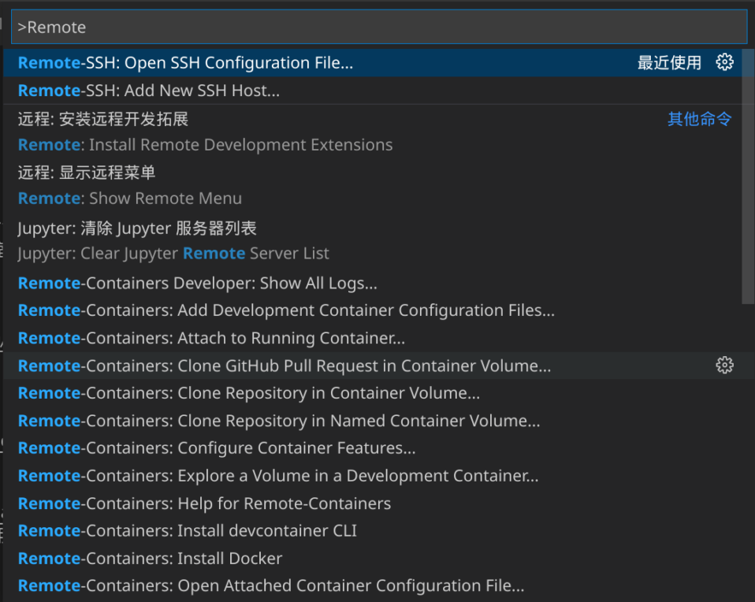
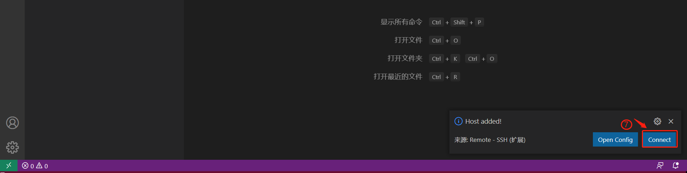
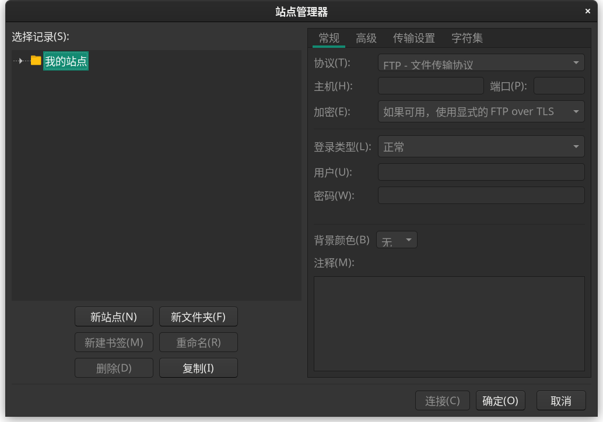

# 容器使用
## ssh 连接
当使用ssh访问容器时，可用使用下面的命令行指令来访问：
```shell
ssh -p [端口] [用户名]@[服务器IP地址]
```
其中端口是容器内22的映射端口，比如说在容器界面显示22->10001，则命令中的[端口]替换为10001。
用户名为登陆服务器时的用户名(DM，GDM等)，服务器IP地址根据访问网络环境决定，如果使用实验室网络则可用使用192.168.100.195，如果使用Zerotier进行访问则使用Zerotier内网服务器IP地址。
ssh免密码登录：
```shell
# linux 系统
ssh-copy-id -p [端口] [用户名]@[服务器IP地址]
# windows系统
## 生成密钥,生成过了可以跳过
ssh-keygen # 一直回车就行
ssh -p [端口] [用户名]@[服务器IP地址] “cat >> ~/.ssh/authorized_keys” < C:/User/[windows用户名]/.ssh/id_rsa.pub
```
就和正常ssh指令一样，等到下一次使用正常ssh登录时就不需要输入密码了（同一台主机）。

## VS Code连接
使用VS Code连接容器进行实验是最舒服的实践(除了付费的PyCharm专业版)。
VS Code连接支持上传下载小文件，编辑代码(高亮、自动提示、git集成等)，运行和调试代码，命令行，端口转发，查看TensorBoard，编辑md和latex文档等功能。

### 安装VS Code
Windows和MacOS:

访问[VS Code官网](https://code.visualstudio.com/download)下载安装包安装.

Debian系(Ubuntu Deepin等):
可用直接在桌面的应用商店或者星火应用商店安装，或者参照这篇[文章](https://www.myfreax.com/how-to-install-visual-studio-code-on-ubuntu-20-04/)使用apt命令安装.

ArchLinux系:
运行指令安装:
```shell
sudo pacman -Syy visual-studio-code-bin
```
### 安装远程控制插件
在VSCode左侧的扩展栏当中搜索Remote - SSH并安装


### 使用
使用F1或Ctrl+Shift+P打开命令面板，输入Remote-SSH，选择Add New SSH ...

在新的框中输入ssh 连接的指令，然后根据提示操作，完成后下方会有提示，点击Connect就完成了连接，之后可用打开远程目录作为工作区。

后面使用时可用在左侧的远程资源管理器快速访问访问过的远程目录。
也可以参考这篇[文章](https://www.jikecloud.net/supports/docs/vscode-intro/)。

VSCode 默认以IP来命名每个连接，但是当保存有多个不同端口的连接是会产生错误，因此建议手动编辑配置文件。F1或Ctrl+Shift+P打开命令面板，输入Remote-SSH，选择Open SSH Configuration File ... ,选择用户目录下的配置文件。下面是一个示例的配置，其中Host的内容是自定义的，起个好记的名字。配置完成后，每次ssh的时候可以使用命令ssh [Host名字]代替原有指令，比如下面的示例可以用ssh server_docker_10022 登陆，并且支持Tab补全。
```shell
Host server_docker_10022
  HostName 192.168.100.195
  Port 10022
  User DM18
```

## PyCharm
PyCharm只有专业版才能远程连接，社区版不能。
笔者没有使用过PyCharm，连接设置可参考[文档1](https://www.autodl.com/docs/pycharm/),[文档2](https://www.jikecloud.net/supports/docs/pycharm-intro/)。

## FileZilla
FileZilla是开源的文件访问软件，是Linux桌面环境的首选软件，Windows系统和MacOS下也一样好用。
VS Code 在传输大文件时会卡死，所以传输训练数据可用使用FileZilla来下载\上传数据。
### 安装 
Windows:
访问[官网](https://filezilla-project.org/download.php?platform=win64&type=server)下载安装包安装

Debian系(Ubuntu Deepin等):
通过商店安装或者通过apt安装:
```shell
sudo apt install filezilla
```
ArchLinux系:
运行指令安装:
```shell
sudo pacman -Syy filezilla
```
MacOS:
访问[官网](https://filezilla-project.org/download.php?platform=osx&type=server)下载安装包安装

### 使用
打开FileZilla软件，打开主界面菜单[文件]->[站点管理器]->[新站点]


协议选择SFTP协议，主机为服务器IP地址，端口为SSH命令的端口，用户名密码为登陆服务器时的用户名密码.

在站点管理器当中可以选择站点进行连接.

## jupyter notebook

jupyter notebook是一个交互式的开发环境，可以在浏览器中运行代码，查看结果，编辑文档，查看TensorBoard等。

一些镜像已经预装了jupyter notebook，并且会自动启用,默认的服务端口为容器内的8888端口,可以通过 http://[服务器IP地址]:[8888对应的映射端口号] 访问。

默认密码为:scnu 

## Code Server
Code Server是一个VS Code的在线版本，可以在浏览器中运行VS Code，支持编辑代码，运行和调试代码，命令行，端口转发，查看TensorBoard，编辑md和latex文档等功能。

一些镜像已经预装了Code Server，并且会自动启用,默认的服务端口为容器内的8080端口,可以通过 http://[服务器IP地址]:[8080对应的映射端口号] 访问。

默认密码为:scnu 

###  修改 Code Server 密码
通过编辑容器内的文件来修改密码，首先进入容器，编辑~/start.sh 文件.

找到export PASSWORD=scnu这一行，将scnu修改为自己的密码，保存退出。

重启容器后就完成了修改。

## 容器环境
使用时容器中的用户等同于服务器主机上的用户，密码也相同。
不同的是，容器中的用户有Super User Do权限，可用使用sudo命令安装软件和运行命令。
容器中一般预装了Pytorch框架和一些常用工具包，或者预装了conda环境。尽量避免安装没有必要的软件，也尽量不要运行apt upgrade命令。
容器中的/home/[user]下的workspace目录与主机上的/data/[user]/workspace是相同的目录，具有相同访问权限。
注意，使用时所有的数据请放在workspace目录下，放在其他目录下的文件将在容器删除时被删除，并且其他目录挂载在服务器的系统盘中，存储空间有限，过多存放数据可能导致服务器出现问题。
pytorch镜像的容器预装了Jupyter，并且会在容器启动时启动，密码为scnu，可以通过修改/home/[user]/.jupyter/jupyter_notebook_config.py来修改密码。conda镜像的容器没有安装jupyter并且没有python，使用Jupyter需要自己配置，可以参考下载https://[服务器IP地址]:9999/static/jupyter_notebook_config.py文件来配置Jupyter，这样就只需要安装Jupyter包。

## zsh

zsh是更强大的命令行环境，容器环境中预装了Oh My ZSH，可以提供命令检查、命令历史记忆等功能，并且提供更加美观的命令行输出。
通过SSH功能登录后如果进入到bash环境可以直接执行命令zsh来打开zsh，VS Code可用在终端上手动选择要使用的shell环境。

## Git

在使用Git相关功能时可能会遇到网络问题，这里提供两种解决方式。

### 使用ghproxy.com加速
比如一个git项目地址是https://github.com/A/B 
```
git clone https://github.com/A/B
# 可以替换为
git clone https://ghproxy.com/https://github.com/A/B 
```


### 使用服务器fastgithub代理服务
服务器上运行了免费的fastgithub加速服务
git终端代理:
```shell
git config --global http.proxy http://192.168.100.195:9995
git config --global https.proxy http://192.168.100.195:9995
```
如果git提示SSL certificate problem,运行:
```shell
git config --global http.sslverify false
```
浏览器代理:
在浏览器代理里面设置http协议的代理,地址为192.168.100.195,端口为9995

同时下载http://192.168.100.195:9996/cacert/fastgithub.crt文件

然后在浏览器设置->证书管理->颁发机构->导入下载好的文件并设置信任


### 使用自己的代理

容器内可访问主机所在的网络，例如容器当中可访问 192.168.120.xxx 的机器，加入Zerotier网络后也能访问Zerotier网络中的主机。
可以在自己的机器当中启用翻墙代理并开启接受来自局域网的请求，并在容器当中将代理指向自己的机器。
设置Git参数：
```shell
git config --global http.proxy http://[你主机的IP]:[代理端口]
git config --global https.proxy http://[你主机的IP]:[代理端口]
如果主机使用socks5代理则使用
git config --global http.proxy socks5://[你主机的IP]:[代理端口]
git config --global https.proxy socks5:/[你主机的IP]:[代理端口]
```

# 管理网站
为了防止不必要的麻烦，请使用谷歌浏览器访问本网站。目前网站不够完善，遇到状态没有刷新或者显示错误请手动刷新网页。
使用GPU进行实验时需要申请，这样是为了防止冲突。如果不使用GPU仅使用CPU可以随意，但是尽量不要跑满所有CPU，否则会影响他人使用，同样尽量不要疯狂读取数据，因为目前使用的数据盘为机械硬盘，读写速度有限。
申请时选择使用的GPU（虽然只有一个），填写使用的时长(以小时为单位)，使用的用途。
在获得了GPU使用许可后就能够使用GPU，但是当使用时间结束时如果还有进程在使用GPU，系统将结束这个进程。
并且在使用过程中，没有许可的用户使用GPU的进程也会被杀死。
需要注意的是，在多GPU环境当中，请在程序中写明使用的GPU，比如申请的是GPU 1但是在程序中使用'cuda:0'也会导致程序被杀死(现在就一张显卡,这行可以当作没看见)。
为了防止恶意占用服务器资源，一个用户同时只能存在一个申请。

## 指令托管
由于申请使用排队管理，可能轮到你的时候是凌晨两三点。
在申请时可以选择一个容器并托管启动指令，当GPU被分配给申请用户时系统会自动执行该指令。
推荐将需要执行的指令写成一个shell脚本，然后托管sh /home/[user]/workspace/目录/xxx.sh 这样的命令。
这里给出一个的shell脚本：
```shell
cd /home/[user]/workspace/[path to py file]
# 因为启动时的目录是/，如果不cd到目标目录会导致程序当中的相对路径失效
python3 train.py >> log.txt
curl http://172.17.0.1:9999/gpumanager/stopearlycontainer?user=[用户名]
```
推荐使用>>log.txt可以将命令输出写到log.txt文件当中，方便查看实验过程。当然，一个完善的实验代码应该包含日志记录子系统，这样才能更好地炼丹。

如果没有托管指令，系统将在分配GPU时通过邮件提醒(前提是填写了邮箱)，~~~但是该凌晨还是在凌晨~~~.

现在，当上一个使用申请结束时（提前或自然等待），如果在晚上10点以后和早上8点以前会优先执行指定了运行命令的申请，而在8点以后到晚上10点时会优先执行无指令申请，同时无指令申请被限制为4小时以下，主要用于Debug,而长时间的运行请使用托管指令运行


## 提前结束

正在使用GPU的用户可以选择在管理界面提前结束使用，系统将会将GPU分配给队列中的下一个用户，因此申请时间可以稍微长一些。
推荐在debug时使用tqdm包来估计一个epoch需要的时间，然后将这个时间乘上轮数再加上5%的缓冲时间。

也可以程序中也通过附加指令来主动结束使用.
比如在运行python脚本时运行:
```shell
python train.py 
curl http://172.17.0.1:9999/gpumanager/stopearlycontainer?user=[用户名]
```
这样，无论前面的指令是否运行成功，(运行完成或出错)都会执行后面的指令。
也可以在python脚本当中访问上面的url，服务器在验证IP地址后会结束相关申请。


## 镜像

系统当中预设了一些容器镜像。
目前计划当中的镜像有：pytorch镜像（已构建）、latex镜像、conda镜像。
如果没有特殊版本要求，请尽量使用pytorch镜像，管理员会在pytorch更新版本后第一时间构建相应容器。
可以在[Github项目](https://github.com/peng-1998/aliyun_docker_images)当中了解镜像的详细信息。

## 申请容器
申请容器可以指定端口映射以及使用的镜像，请仔细阅读镜像环境和使用说明后再申请容器。
为了防止浪费，每个用户最多同时拥有3个容器。
如果有其他需求可以在设置的建议栏进行留言。


## 设置邮箱
用户可以在设置页设置邮箱，服务器会在GPU可用时及其他一些场合发邮件提醒。
建议使用QQ邮箱，并在微信当中打开提醒，以及时接收邮件。

# 服务器访问
在计算机学院楼网络当中可以使用IP:192.168.100.195访问服务器。
如果在非局域网环境可以使用Zerotier访问服务器，在任何能够访问互联网的地方都能访问服务器。
## 安装zerotier
windows，MacOS，以及Andorid，ios:
访问[官网](https://www.zerotier.com/download/)下载安装包安装

Debian系(Ubuntu Deepin等)和红帽系(redhat，centos等):
执行:
```shell
curl -s https://install.zerotier.com | sudo bash
```

ArchLinux系:
执行:
```shell
sudo pacman -Syy zerotier-one
```
## 添加网络
windows，MacOS，以及Andorid，ios:
在界面当中加入网络:af415e486f4bb950

linux系统:
执行:
```shell
zerotier-cli join af415e486f4bb950
```
管理员会不定期审核，加入网络后可以通过IP:10.147.17.1访问服务器

# 镜像加速
由于华师的网速不太行,在安装pytorch这样的包的时候安装速度慢,并且容易超时.
服务器上设置了部分开源软件镜像缓存用于加速下载速度.
下列ip地址也也可以用zerotier网络当中的ip代替.
注意，以下加速都属于缓存加速，并且配置了保质期，第一次下载的包或很久一段时间没有使用的包在下载时不会很快。
## ubuntu
2004 和2204 版本将下列源替换到/etc/apt/source.list
```
<!-- ubuntu 2004 -->
deb http://192.168.100.195:9998/ubuntu/ focal main restricted universe multiverse
deb http://192.168.100.195:9998/ubuntu/ focal-updates main restricted universe multiverse
deb http://192.168.100.195:9998/ubuntu/ focal-backports main restricted universe multiverse
deb http://192.168.100.195:9998/ubuntu/ focal-security main restricted universe multiverse

<!-- ubuntu 2204 -->
deb http://192.168.100.195:9998/ubuntu/ jammy main restricted universe multiverse
deb http://192.168.100.195:9998/ubuntu/ jammy-updates main restricted universe multiverse
deb http://192.168.100.195:9998/ubuntu/ jammy-backports main restricted universe multiverse
deb http://192.168.100.195:9998/ubuntu/ jammy-security main restricted universe multiverse
```
## archlinuxcn
服务器上设置了archlinuxcn源.
/etc/pacman.conf 添加或替换:

```
[archlinuxcn]
Server = http://192.168.100.195:9998/archlinuxcn/$arch
```
## manjaro 源
服务器上设置了manjaro源.
/etc/pacman.conf 添加或替换:

```
[core]
SigLevel = PackageRequired
Server = http://192.168.100.195:9998/manjaro/stable/$repo/$arch

[extra]
SigLevel = PackageRequired
Server = http://192.168.100.195:9998/manjaro/stable/$repo/$arch

[community]
SigLevel = PackageRequired
Server = http://192.168.100.195:9998/manjaro/stable/$repo/$arch

[multilib]
SigLevel = PackageRequired
Server = http://192.168.100.195:9998/manjaro/stable/$repo/$arch
```
## pypi
普通库执行
```
pip config set global.index-url http://192.168.100.195:9997/root/pypi/+simple/
```
因为该pypi缓存没有https证书,所以不能进行SSL连接.在安装库时需要添加 --trusted-host 192.168.100.195 参数.
或者执行以下指令,就不用每次安装时都需要输入--trusted-host 192.168.100.195
```shell
pip config set install.trusted-host 192.168.100.195
```

比如:
```
pip install numpy --trusted-host 192.168.100.195
# 执行pip config set install.trusted-host 192.168.100.195后
pip install numpy
```
或者在安装时使用:
```
pip install pkg_name --trusted-host 192.168.100.195 -i  http://192.168.100.195:9997/root/pypi/+simple/
```
pytorch 安装
```
<!-- cuda 11.3: -->
pip install torch==1.12.1+cu113 torchvision==0.13.1+cu113 --trusted-host 192.168.100.195 --extra-index-url  http://192.168.100.195:9997/root/pytorch/+simple/
<!-- cuda 11.6: -->
pip install torch==1.12.1+cu116 torchvision==0.13.1+cu116 --trusted-host 192.168.100.195 --extra-index-url  http://192.168.100.195:9997/root/pytorch/+simple/
```
记住一定要指定版本和cu版本,否则会下载所有版本的包.
torch和torchvision版本的关系为:
torch=1.[x].y torchvision=0.[x+1].y
有哪些包可以在http://192.168.100.195:9997/root/pytorch/+simple/torch/ 页面查看

torch 1.13.0 开始安装pytorch不再需要指定路径,直接使用以下指令安装即可:
```shell
pip install torch torchvision
```

## DNS解析
学校默认的DNS服务器，我只能说DDDD.
服务器配置了DNS解析服务，上游是腾讯和阿里的DNS服务器
在网络设置里将DNS服务器地址设置为服务器地址就行（不需要加端口）


# 代理服务
服务器上设置了http/https代理服务,可以用于校外通过校园网获取论文等资源（只对zerotier网络开放）.
## 使用方法
在浏览器当中设置代理,代理地址为http://10.147.17.1:9994

# 常用软件
除了软件镜像,在http://192.168.100.195:9996网页还准备了一些软件.
目前有:
Visio 2019 2021
Office(Word + ppt + excal) 2019
Linux发行版镜像:manjaro ubuntu deepin

# grand challenge 打包镜像指南

打包镜像需要在服务器的宿主机上运行，即从22端口ssh进入

```shell
ssh -p 22 DM[...]@192.168.100.195
```

也可以在本地进行下列打包操作，如linux系统，或是windows系统安装了wsl2子系统，或linux虚拟机等环境。

打包镜像的一般流程为：
准备文件（代码，数据，脚本，Dockerfile）-> 构建镜像 -> 测试镜像 -> 导出镜像 -> 上传镜像

执行docker 命令需要sudo权限，没有权限的可以向管理员申请（微信）
## 准备文件
准备相关打包文件，通常结构为：
...pack_dir/code/xxx.py                          //代码文件 就是你的算法的代码
...pack_dir/requirments.txt                      //依赖文件，按照算法需要设置
...pack_dir/process.py                           //处理文件，程序入口
...pack_dir/data/xxx.npy or xxx.pth              //数据文件，按照算法需要设置

...pack_dir/test.sh and export.sh and build.sh  //用于测试，导出，构建镜像的脚本
...pack_dir/Dockerfile                          //构建镜像的配置文
...pack_dir/input                                //用于测试的文件夹，存放一些测试用例，来保证打包的算法可以删除正常的结果
...pack_dir/output                               //用于测试的文件夹，存放一些测试用例，来保证打包的算法可以删除正常的结果

build.sh 的通常内容是：
```shell
#!/usr/bin/env bash
ALGPATH="$( cd "$(dirname "$0")" ; pwd -P )"

sudo docker build -t [镜像名] "$ALGPATH"
```

test.sh 的通常内容是：
```shell
#!/usr/bin/env bash

ALGPATH="$( cd "$(dirname "$0")" ; pwd -P )"

#测试镜像
sudo docker run --rm \
        --shm-size="4g" \  # 设置共享内存大小，对于pytorch的多线程DataLoader来说，这个参数很重要，如果没有使用多线程DataLoader（如单线程或手动加载数据）可以不设置
        --gpus all \       # 使用GPU
        -v $ALGPATH/input:/input \
        -v $ALGPATH/output:/output/ \
        [镜像名（build.sh里的构建产生的镜像的名称）]

```

export.sh 的通常内容是：
```shell
docker save [镜像名] | gzip -c > "[爱叫什么叫什么].tar.gz"
```

其中Dockerfile可以根据模板做适当修改。

这是一份模板：
```dockerfile
#挑选合适的基础镜像，可以在https://hub.docker.com/上搜索，推荐使用pytorch/pytorch:...的镜像
# 如果使用基于pytorch/pytorch的镜像，那么requirements.txt中的torch和torchvision请删除
FROM pytorch/pytorch:1.13.1-cuda11.6-cudnn8-runtime
# FROM ubuntu:20.04

# 使用服务器上的apt源，加快构建速度
RUN echo "deb http://192.168.100.195:9998/ubuntu/ focal main restricted universe multiverse" > /etc/apt/sources.list \
    && echo "deb http://192.168.100.195:9998/ubuntu/ focal-updates main restricted universe multiverse" >> /etc/apt/sources.list \
    && echo "deb http://192.168.100.195:9998/ubuntu/ focal-backports main restricted universe multiverse" >> /etc/apt/sources.list \
    && echo "deb http://192.168.100.195:9998/ubuntu/ focal-security main restricted universe multiverse" >> /etc/apt/sources.list     

# 安装包 libgl1-mesa-glx 为运行opencv-python必须的包
RUN apt update \
    && apt install libgl1-mesa-glx -y  

# 如果使用ubuntu:20.04作为基础镜像，还需要安装python3和pip3等
# RUN apt install python3 python3-pip python-is-python3 gcc python3-dev -y


RUN groupadd -r algorithm && useradd -m --no-log-init -r -g algorithm algorithm

RUN mkdir -p /opt/algorithm /input /output \
    && chown algorithm:algorithm /opt/algorithm /input /output

USER algorithm

WORKDIR /opt/algorithm

ENV PATH="/home/algorithm/.local/bin:${PATH}"
# 使用服务器上的镜像缓存加速pip下载，如果在安装包时出现错误可以尝试换成清华源 （缓存的上游为清华源）
RUN pip config set global.index-url http://192.168.100.195:9997/root/pypi/+simple/ \
    && pip config set install.trusted-host 192.168.100.195 && python -m pip install --user -U pip
# 拷贝文件，--chown=algorithm:algorithm 的意思是将文件的所有者和所属组都设置为algorithm

COPY --chown=algorithm:algorithm requirements.txt /opt/algorithm/
COPY --chown=algorithm:algorithm process.py /opt/algorithm/
COPY --chown=algorithm:algorithm data/ /opt/algorithm/data/
COPY --chown=algorithm:algorithm code/ /opt/algorithm/code/
# 安装需要的pip包
RUN python -m pip install --user -r requirements.txt

# 程序入口，一般不需要修改
ENTRYPOINT python -m process $0 $@
```

如果基础环境不改变，但是后续代码以及数据有变化，需要多次打包，可以将Dockerfile拆成两个文件，一个是基础环境，一个是代码和数据，这样可以加快构建速度。
下面是一个示例的配置
```dockerfile
# Dockerfile.base 文件
FROM pytorch/pytorch:1.13.1-cuda11.6-cudnn8-runtime
# FROM ubuntu:20.04

# 使用服务器上的apt源，加快构建速度
RUN echo "deb http://192.168.100.195:9998/ubuntu/ focal main restricted universe multiverse" > /etc/apt/sources.list \
    && echo "deb http://192.168.100.195:9998/ubuntu/ focal-updates main restricted universe multiverse" >> /etc/apt/sources.list \
    && echo "deb http://192.168.100.195:9998/ubuntu/ focal-backports main restricted universe multiverse" >> /etc/apt/sources.list \
    && echo "deb http://192.168.100.195:9998/ubuntu/ focal-security main restricted universe multiverse" >> /etc/apt/sources.list     

# 安装包 libgl1-mesa-glx 为运行opencv-python必须的包
RUN apt update \
    && apt install libgl1-mesa-glx -y  

# 如果使用ubuntu:20.04作为基础镜像，还需要安装python3和pip3等
# RUN apt install python3 python3-pip python-is-python3 gcc python3-dev -y


RUN groupadd -r algorithm && useradd -m --no-log-init -r -g algorithm algorithm

RUN mkdir -p /opt/algorithm /input /output \
    && chown algorithm:algorithm /opt/algorithm /input /output

USER algorithm

WORKDIR /opt/algorithm

ENV PATH="/home/algorithm/.local/bin:${PATH}"
# 使用服务器上的镜像缓存加速pip下载，如果在安装包时出现错误可以尝试换成清华源 （缓存的上游为清华源）
RUN pip config set global.index-url http://192.168.100.195:9997/root/pypi/+simple/ \
    && pip config set install.trusted-host 192.168.100.195 && python -m pip install --user -U pip
# 拷贝文件，--chown=algorithm:algorithm 的意思是将文件的所有者和所属组都设置为algorithm

COPY --chown=algorithm:algorithm requirements.txt /opt/algorithm/
RUN python -m pip install --user -r requirements.txt
```

```dockerfile
# Dockerfile 文件
FROM [镜像名]:[版本号] 
# [镜像名]:[版本号] 为上一个Dockerfile.base构建的镜像

USER algorithm

WORKDIR /opt/algorithm

COPY --chown=algorithm:algorithm process.py /opt/algorithm/
COPY --chown=algorithm:algorithm data/ /opt/algorithm/data/
COPY --chown=algorithm:algorithm code/ /opt/algorithm/code/

ENTRYPOINT python -m process $0 $@
```

## 构建镜像
在pack_dir目录下执行：
```shell
sh build.sh
# 或者
sudo docker build -t [镜像名] .
```

## 测试镜像
在pack_dir目录下执行：
```shell
sh test.sh
# 或者
sudo docker run --rm --name [容器名] --shm-size="4g" --gpus all -v $PWD/input:/input -v $PWD/output:/output/ [镜像名]
```
由于gpu管理系统对于gpu进行管理，为了保证test的程序被正确执行，请提前申请gpu,并在测试时将[容器名]设置为 DMx_y,x为数字，y为abc三个字母之一，并且不应该与已有的容器名重复。

## 导出镜像
在pack_dir目录下执行：
```shell
sh export.sh
# 或者
sudo docker save [镜像名] | gzip -c > "[爱叫什么叫什么].tar.gz"
```
导出后，该文件夹下会生成一个[爱叫什么叫什么].tar.gz文件，这个文件就是镜像文件，可以通过filezilla，winscp等软件下载到本地。

## 删除镜像和容器
在构建过程中不可避免的会出现一些错误，会留下一些无用的镜像和容器，这些镜像和容器会占用服务器的存储空间，因此需要删除。

```shell
# 查看容器
sudo docker ps -a
# 结果
# CONTAINER ID   IMAGE                          COMMAND                  CREATED         STATUS                     PORTS     NAMES
# 8bb7af0c74b0   631ce02df8d4                   "/bin/sh -c 'apt upd…"   2 hours ago     Exited (1) 2 hours ago   mystifying_kalam
# 0a20ac1cf304   631ce02df8d4                   "/bin/sh -c 'apt upd…"   2 hours ago     Exited (1) 2 hours ago   quizzical_jepsen
# c75c778eadce   631ce02df8d4                   "/bin/sh -c 'apt upd…"   2 hours ago     Exited (1) 2 hours ago   gifted_grothendieck
# d79f67a9b197   e3da74d08fb8                   "/bin/sh -c 'apt upd…"   2 hours ago     Exited (1) 2 hours ago   gallant_kilby
# 构建中产生的容器名为一串随机字符，特点就是没有什么实际含义，可以通过这个特点判断是否是构建过程中产生的容器，删除是要谨慎，不要删除正在运行的容器
# 不能删除的容器包括filebrowser，dnsserver，tinyproxy，mirrors_pypi，mirrors_nginx ，DMxxx
# 删除容器
sudo docker rm -f 8bb7af0c74b0 0a20ac1cf304 c75c778eadce d79f67a9b197 
```

```shell
# 查看镜像
sudo docker images
# 结果
  # testsubmission           latest                     38d54927c4f6   About an hour ago   1.26GB
  # <none>                   <none>                     7328df7a4f0b   About an hour ago   1.48GB
  # <none>                   <none>                     e3da74d08fb8   2 hours ago         72.8MB
  # python                   3.8-slim                   99f5de4b63d9   3 weeks ago         147MB
  # python                   3.9-slim                   bf997dc3a626   2 months ago        145MB
# 这些镜像中，testsubmission是我们刚刚构建的镜像，但由于该镜像已经打包好了，因此可以删除
sudo docker rmi 38d54927c4f6
# <none> 镜像是一定要删除的,执行：
sudo docker rmi $(sudo docker images -f "dangling=true" -q)
# python 镜像是基础镜像，如果以后不再使用，也可以删除

```

## 上传镜像
根据自己比赛的要求，上传镜像到比赛平台。


# Debug指南
## 代码Debug
在申请使用GPU前应该在CPU模式下进行调试，在cpu模式没有问题时再申请GPU调试。
可以使用全局变量:
```Python
device = 'cpu'#'cuda:0'
```
在使用GPU时只需要将device改成'cuda:0'即可。
在变量需要放到GPU当中时使用 x=x.to(device) 而不是使用 x=x.cuda()。

并且重点检查网络模型，从Dataloader加载的数据是否执行了to(device)，而其他运算时重点查看torch.tensor，zeros，ones函数等附近的运算是否有设备不一致的情况。

## 调试
调试可以使用vscode python插件的调试功能，但是在正式运行时请不要使用调试运行，因为在出问题后调试插件不会结束程序而是一直占用显存和内存。

## Jupyter无法访问
当jupyter无法访问时请检查/home/[用户名]/.jupyter/jupyter_notebook_config.py文件，可以使用https://[服务器IP地址]:9999/static/jupyter_notebook_config.py文件替换。

## GPU错误
有时，多次运行GPU程序时会出现奇怪的错误，这时可以尝试重启容器解决.
如果在执行nvidia-smi命令时出现Failed to initialize NVML: Driver/library version mismatch，是因为驱动版本问题，不影响使用，只是看不到显存等信息。如果是服务器本地环境出现这样的错误，是Nvidia驱动自动升级，管理员将在没有人使用服务器时重启服务器。

## SSH无法登录
如果遇到无法登录的情况，先检查是否可以ping通服务器，再检查端口有没有错。
最有可能的就是密钥出现了问题，这个时候可以找到known_hosts文件（Linux：/home/[user]/.ssh/known_hosts ;windows:C:/Users/[user]/.ssh/known_hosts）。记事本打开这个文件，然后将现在登录的ip和端口对应的项删除就可以了。

## ImportError: libGL.so.1: cannot open shared object file: No such file or directory
这是因为缺少libGL.so.1库，可以通过安装libgl1-mesa-glx来解决。
```shell
sudo apt install libgl1-mesa-glx
```

# 更新日志
20220901：
  - 添加无指令请求在非工作时间的顺延逻辑
  - 添加工作时间优先执行无指令申请的逻辑
  - 添加防止饥饿的逻辑
  - 修改了一系列BUG,这一系列BUG曾导致：某些用户可以看到其他用户的容器并使用,某些用户申请的可执行时间内某些特定用户可以使用GPU
  - 去除了历史申请队列当中的重复项
  现在，当上一个使用申请结束时（提前或自然等待），如果在晚上10点以后和早上8点以前会优先执行指定了运行命令的申请，而在8点以后到晚上10点时会优先执行无指令申请，同时无指令申请被限制为4小时以下，主要用于Debug,而长时间的运行请使用托管指令运行。

20220903:
  - 使用TinyDB代替原有的数据存储
  - 更新了登陆UI

20220906:
  - 修复了一个bug,该bug曾导致自然结束的申请未被结束
  - 修复了一个容器bug,该bug曾导致容器启动后自动关闭
  - 发现一个待修复的UI bug,该bug导致容器管理管理按钮除了最下面的按钮无法使用

20220930:
  - 添加了开源软件镜像缓存

20221114:
  - 增加了pytorch 1.13.0镜像,新镜像默认使用服务器pypi缓存和ubuntu镜像,并且使用服务器上的fastgithub代理服务

20230316:
  - 增加了pytorch 2.0镜像,新镜像默认使用服务器pypi缓存和ubuntu镜像,并且使用服务器上的fastgithub代理服务,并且增加了Code-Server服务
  - 增加了远程代理服务,通过将http/https 的代理设置为10.147.17.1:9994 即可在校外通过代理访问学校已经购买的论文库

20230421：
  - 添加了manjaro镜像

20230427：
  - 添加了dns解析服务